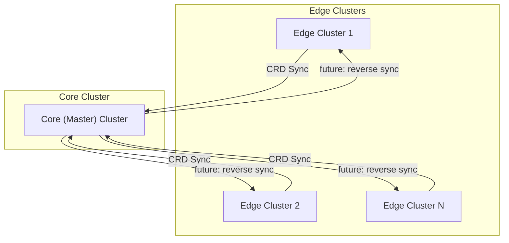

# resonance
Resonance is a simple, experimental multi-cluster Kubernetes operator designed for edge-to-core resource synchronization in edge computing environments. It aims to keep custom resources consistent across edge and core (master) clusters, addressing the unique challenges of distributed edge architectures.

## Architecture Overview


This diagram shows the basic flow: edge clusters synchronize selected resources to the core (master) cluster. Future phases will add reverse sync and more advanced features.

## Description
Resonance is a proof-of-concept (POC) project focused on synchronizing Kubernetes resources from edge clusters to a central core (master) cluster. In its initial phase, Resonance provides a straightforward controller that uses the Kubernetes API to sync a set of pre-defined (sample) CRDs from edge clusters to the core. This enables a basic, reliable mechanism for propagating resource state from distributed edge locations to a central cluster.

Future phases will make Resonance more generic and powerful:
- Add support for syncing arbitrary CRDs and resources, not just pre-defined samples.
- Introduce gRPC-based communication for more efficient and flexible edge-to-core synchronization.
- Implement reverse synchronization, allowing updates from the core to be propagated back to edge clusters, ensuring bidirectional consistency.
- Address advanced challenges such as conflict resolution, so that edge clusters can safely merge updates from both the master and their own local changes.

The major architectural challenge is enabling edge clusters to receive and reconcile updates from both the master and their own local state, while handling conflicts in a robust way. Resonance is an experimental platform to explore and solve these problems in a simplified, modular manner.

This project is intended for experimentation and learning in the edge computing space, and is not yet production-ready. Contributions and feedback are welcome!

## Getting Started

### Prerequisites
- go version v1.24.0+
- docker version 17.03+.
- kubectl version v1.11.3+.
- Access to a Kubernetes v1.11.3+ cluster.

### To Deploy on the cluster
**Build and push your image to the location specified by `IMG`:**

```sh
make docker-build docker-push IMG=<some-registry>/resonance:tag
```

**NOTE:** This image ought to be published in the personal registry you specified.
And it is required to have access to pull the image from the working environment.
Make sure you have the proper permission to the registry if the above commands don’t work.

**Install the CRDs into the cluster:**

```sh
make install
```

**Deploy the Manager to the cluster with the image specified by `IMG`:**

```sh
make deploy IMG=<some-registry>/resonance:tag
```

> **NOTE**: If you encounter RBAC errors, you may need to grant yourself cluster-admin
privileges or be logged in as admin.

**Create instances of your solution**
You can apply the samples (examples) from the config/sample:

```sh
kubectl apply -k config/samples/
```

>**NOTE**: Ensure that the samples has default values to test it out.

### To Uninstall
**Delete the instances (CRs) from the cluster:**

```sh
kubectl delete -k config/samples/
```

**Delete the APIs(CRDs) from the cluster:**

```sh
make uninstall
```

**UnDeploy the controller from the cluster:**

```sh
make undeploy
```

## Project Distribution

Following the options to release and provide this solution to the users.

### By providing a bundle with all YAML files

1. Build the installer for the image built and published in the registry:

```sh
make build-installer IMG=<some-registry>/resonance:tag
```

**NOTE:** The makefile target mentioned above generates an 'install.yaml'
file in the dist directory. This file contains all the resources built
with Kustomize, which are necessary to install this project without its
dependencies.

2. Using the installer

Users can just run 'kubectl apply -f <URL for YAML BUNDLE>' to install
the project, i.e.:

```sh
kubectl apply -f https://raw.githubusercontent.com/<org>/resonance/<tag or branch>/dist/install.yaml
```

### By providing a Helm Chart

1. Build the chart using the optional helm plugin

```sh
kubebuilder edit --plugins=helm/v1-alpha
```

2. See that a chart was generated under 'dist/chart', and users
can obtain this solution from there.

**NOTE:** If you change the project, you need to update the Helm Chart
using the same command above to sync the latest changes. Furthermore,
if you create webhooks, you need to use the above command with
the '--force' flag and manually ensure that any custom configuration
previously added to 'dist/chart/values.yaml' or 'dist/chart/manager/manager.yaml'
is manually re-applied afterwards.

## Contributing
We welcome contributions! To contribute:
- Fork the repository and create a feature branch.
- Make your changes, following Go and Kubernetes best practices.
- Run `make fmt` and `make vet` to ensure code quality.
- Add or update tests as needed (`make test` for unit tests, `make test-e2e` for end-to-end tests).
- Submit a pull request with a clear description of your changes.
- For major changes, please open an issue first to discuss your proposal.


**NOTE:** Run `make help` for more information on all potential `make` targets.

More information can be found via the [Kubebuilder Documentation](https://book.kubebuilder.io/introduction.html)

## License

Copyright 2025.

Licensed under the Apache License, Version 2.0 (the "License");
you may not use this file except in compliance with the License.
You may obtain a copy of the License at

    http://www.apache.org/licenses/LICENSE-2.0

Unless required by applicable law or agreed to in writing, software
distributed under the License is distributed on an "AS IS" BASIS,
WITHOUT WARRANTIES OR CONDITIONS OF ANY KIND, either express or implied.
See the License for the specific language governing permissions and
limitations under the License.

